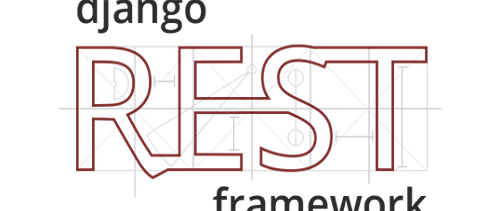
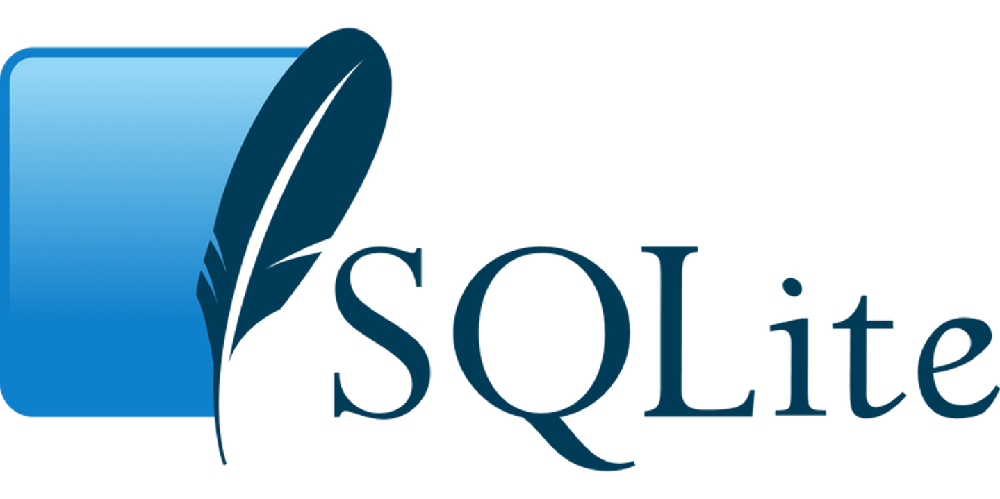
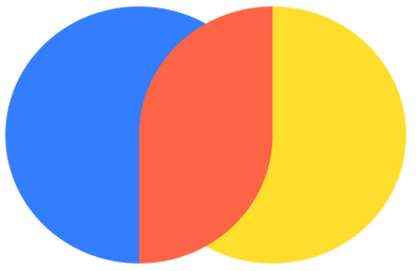

# **Smart Resume**

**Smart Resume** is an AI-powered application designed to streamline the process of reformatting and enhancing resumes. It takes resumes in PDF format and uses advanced AI models to restructure and reorganize them into a standardized format. This application is particularly useful for companies specializing in open-sourcing talent, allowing HR teams to efficiently search and enhance resumes based on specific project requirements.

## **Features**

- **Upload, Delete, and View Resumes**: A dedicated page where users can upload resumes in PDF format, view the uploaded resumes, or delete them from the database.
- **Similarity Search**: Enables HR teams to perform a similarity search across the database using a query. The system will find resumes that closely match the query.
- **Resume Enhancement**: AI-powered enhancement for resumes, optimizing their content to match the query. This feature is particularly useful for improving candidate fit for specific projects.
- **Secure Authentication**: A robust email-based authentication system ensures that only authorized users can access the application.
- **Modular AI Integration**: The application supports multiple AI models, allowing users to perform enhancement using OpenAI’s models, as well as other open-source models from Ollama and Hugging Face.

## Technology Stack

### **Backend**
<p align="left">
  
  Django Rest Framework: Provides a flexible API interface for handling resume uploads, management, and querying.
</p>

<p align="left">
  
     SQLite3: Stores the resumes and user information.
</p>

<p align="left">
  
     ChromaDB: A vector database used for similarity searches across resumes.
</p>

<p align="left">
  
  Ngrok: Used for hosting the application and exposing local servers to the internet.
</p>

### **AI Models & Integration**
<p align="left">
  &nbsp;&nbsp;
  
  &nbsp;&nbsp;&nbsp;&nbsp;&nbsp;&nbsp;&nbsp;OpenAI: Utilizes advanced models for enhancing and restructuring resume content.
</p>

<p align="left">
  &nbsp;
  
  &nbsp;&nbsp;&nbsp;&nbsp;&nbsp;&nbsp;Ollama: Supports open-source models for AI-driven resume enhancement.
</p>

<p align="left">
  
  &nbsp;&nbsp;&nbsp;Hugging Face: Leverages powerful transformers from Hugging Face for NLP tasks.<br>
</p>

<p align="left">
  
  &nbsp;LangChain: Integrates the various AI models into the application.
</p>

## **How it Works**

1. **Upload Resumes**: HR teams can upload resumes in PDF format through the user interface. The resumes are stored in an SQLite3 database.
2. **Similarity Search**: Use a query to search through the database of resumes. The application performs a similarity search using ChromaDB, identifying resumes that are most relevant to the given query.
3. **Resume Enhancement**: After selecting relevant resumes, users can enhance them using AI models. This involves reformatting and restructuring the resume’s content to better match the project requirements, ensuring a stronger match between the candidate’s skills and the project needs.
4. **Flexible AI Models**: The modular nature of the application allows HR teams to choose between OpenAI’s proprietary models or any other open-source AI models (e.g., from Hugging Face or Ollama) for resume enhancement.

## **Use Case**

Smart Resume is particularly effective for HR teams in companies that specialize in **open-sourcing talent**. It allows them to:

- Efficiently search through a large database of resumes using custom queries.
- Automatically enhance the resumes of selected candidates to make them more suitable for specific projects.
- Save time and improve the overall process of selecting and optimizing candidate resumes for particular projects.

For example, HR teams can query the resume database based on project-specific skills, identify potential candidates, and then enhance their resumes so that they better align with the project’s requirements before presenting them to clients.

## **Setup Instructions**

To get the application running locally:

1. **Clone the repository**:
    ```bash
    git clone https://github.com/pnd-andrei/Smart-Resume.git
    cd resumecentral
    ```

2. **Create a virtual environment**:
    ```bash
    python -m venv env
    source env/bin/activate
    ```

3. **Install the required dependencies**:
    ```bash
    pip install -r requirements.txt
    poetry install
    ```

4. **Run database migrations**:
    ```bash
    python manage.py migrate
    ```

5. **Run the application**:
    ```bash
    python manage.py runserver
    ```

6. **Set up Ngrok (for external access)**:
    ```bash
    ngrok http 8000
    ```

